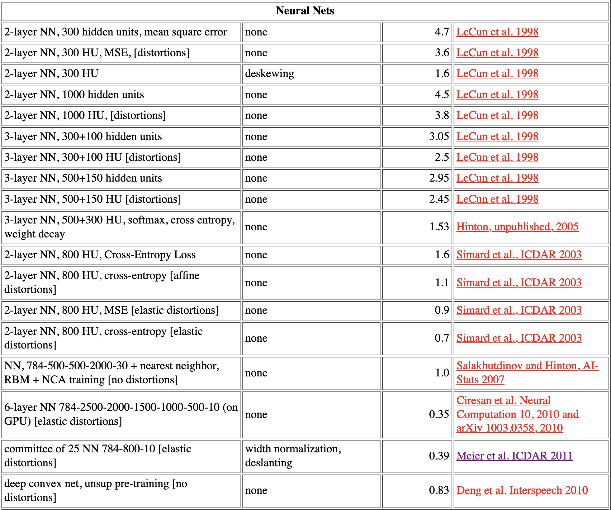
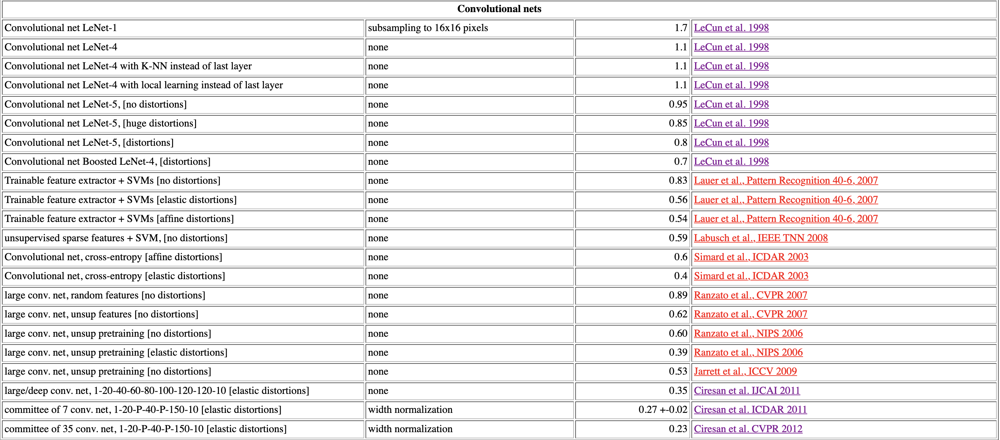

# Weekly report
### week1 DONE：

1. 学习完了吴恩达网课的第一部分：神经网络和深度学习
2. 手推了以m个样本同时传播的全连接神经网络的前向传播，和后项求导的向量化公式，了解了向量化后的网路每个向量的每一纬度的意义！
3. python 实现了一个可用性很强的全链接网络的类，设计之初，它可以自定义每一层的宏参数，包括（项目见week1目录）：
    + 每层神经元数及他们使用的激活函数（relu，leakyrelu，sigmoid）
    + 神经层的层数
    + 损失函数：ems，l(a, y) = -(y*log(a) + (1-y)*log(1-a))
    + 传播时的样本数
    项目状态：项目基本写完，主要问题在于不熟悉python的各种容器，数据在容器间的跳转产生了bug，在调试中
    
    map：
    映射函数访问不到self，在类中，self不能作为参数
    映射序列只能是行向量，并且numpy的形状变换用flatten，不要用reshape    

### week2 DONE:
1. 学习完成吴恩达网课第二部分：改善深层次神经网络
2. 看了《deep learning》中前三章
3. 复习了模型评估的各种方法，数据预处理，bias与variance等等

### week3 DONE:
+ week3主题：学习网络模型和视觉特征
    1. 学习吴恩达的课程中：《结构化机器学习项目》、《卷积神经网络》
    2. 阅读《deep learning》
    2. 复习《计算机视觉》、《数字图像处理》课程中，提取图形特征的方法，以及相关一些算法
    3. 全链接网络做minist-handwriting-digits数据集，尝试多种方法和参数。并阅读此数据集上[全链接网络的论文](http://yann.lecun.com/exdb/mnist/)学习他人的参数和背后的思想
    
    4. 使用卷积网络模型做minist-handwriting-digits数据集，尝试多种方法和参数。并阅读此数据集上[全链接网络的论文](http://yann.lecun.com/exdb/mnist/)学习他人的参数和背后的思想
    
       
### week4 DONE:
+ week4主题:巩固和实践
    1. 学习吴恩达课程《序列模型》
    2. 继续看minist-handwriting-digits数据集上的论文和模型，FC+COV，实践！实践！实践！
        FC：weights initialization, activation function, loss function, regularization，mini-batch normalization，Adam...
        COV: minist-handwriting dataset
    3. 阅读完《deep learning》
    
### PLANE:
+ week5主题:阅读卷积网络相关论文，看一些现有的目标追踪模型和论文
    papers:
        1. You only look once
        2. vgg-16
        3. FaceNet: A Unified Embedding for Face Recognition and Clustering
        4. DeepFace: Closing the Gap to Human-Level Performance in Face Verification
        5. 
    modeling:
  
github：https://github.com/loongMin/objectTracking/blob/main/DONE%26TODO.md
  
+ week6主题: