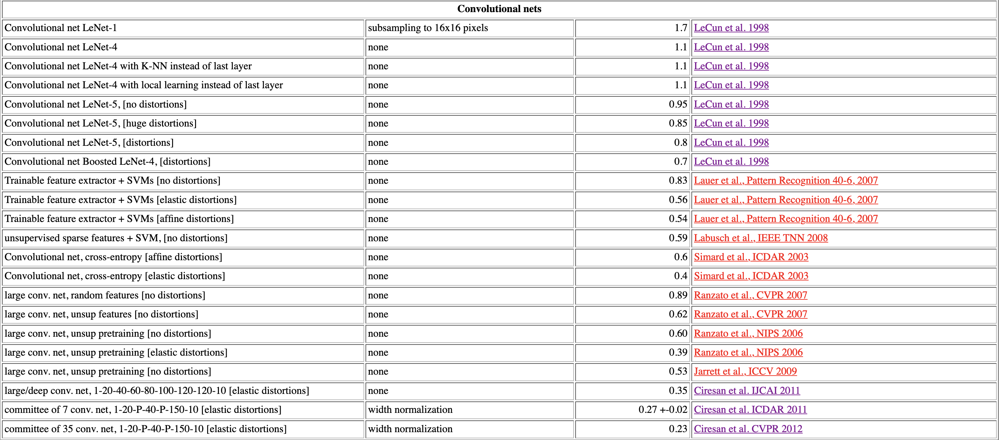

# 资料
### 基础学习
+ Bengio所著的《Deep Learning》
[原文官网](https://www.deeplearningbook.org/)
[原文翻译](https://github.com/exacity/deeplearningbook-chinese)
		
+ andrew的课程 
[网课](https://mooc.study.163.com/university/deeplearning_ai#/c)
[习题和答案讲解](https://blog.csdn.net/weixin_36815313/article/details/105728919)
	1. 神经网络和深度学习
	2. 改善深层次神经网络
	3. 卷积神经网络
	4. 序列模型
	
	

+ 李宏毅-2021 
[课程](https://speech.ee.ntu.edu.tw/~hylee/ml/2021-spring.html)
[资料](https://app6ca5octe2206.pc.xiaoe-tech.com/detail/p_6049e1c6e4b05a6195befd56/6)
	

+ 论坛与社区

	[Techbeat](https://www.techbeat.net/)
	
	[ZihaoZhao](https://www.zhihu.com/column/c_1102212337087401984)

+ 附加资料

	数学之美-吴军

### 前沿
前沿论文：
	知乎博主总结：https://zhuanlan.zhihu.com/p/65177442

模型：
[deep_sort](https://github.com/ZQPei/deep_sort_pytorch), 
[mm](https://github.com/open-mmlab/mmtracking)

数据集：
+ Kaggle预测房价：[House Prices - Advanced Regression Techniques](https://www.kaggle.com/c/house-prices-advanced-regression-techniques)

    
    
    
    
    
# 周报
### week1 DONE：

1. 学习完了吴恩达网课的第一部分：神经网络和深度学习
2. 手推了以m个样本同时传播的全连接神经网络的前向传播，和后项求导的向量化公式，了解了向量化后的网路每个向量的每一纬度的意义！
3. python 实现了一个可用性很强的全链接网络的类，设计之初，它可以自定义每一层的宏参数，包括（项目见week1目录）：
    + 每层神经元数及他们使用的激活函数（relu，leakyrelu，sigmoid）
    + 神经层的层数
    + 损失函数：ems，l(a, y) = -(y*log(a) + (1-y)*log(1-a))
    + 传播时的样本数
    项目状态：项目基本写完，主要问题在于不熟悉python的各种容器，数据在容器间的跳转产生了bug，在调试中
    
    map：
    映射函数访问不到self，在类中，self不能作为参数
    映射序列只能是行向量，并且numpy的形状变换用flatten，不要用reshape    

### week2 DONE:
1. 学习完成吴恩达网课第二部分：改善深层次神经网络
2. 看了《deep learning》中前三章
3. 复习了模型评估的各种方法，数据预处理，bias与variance等等

### PLANE:    
+ week3主题：学习网络模型和视觉特征
    1. 学习吴恩达的课程中：《结构化机器学习项目》、《卷积神经网络》和《序列模型》
    2. 阅读《deep learning》
    2. 复习《计算机视觉》、《数字图像处理》课程中，提取图形特征的方法，以及相关一些算法
    3. 全链接网络做minist-handwriting-digits数据集，尝试多种方法和参数。并阅读此数据集上[全链接网络的论文](http://yann.lecun.com/exdb/mnist/)学习他人的参数和背后的思想
    
    4. 使用卷积网络模型做minist-handwriting-digits数据集，尝试多种方法和参数。并阅读此数据集上[全链接网络的论文](http://yann.lecun.com/exdb/mnist/)学习他人的参数和背后的思想
    
    
+ week4主题
    继续看minist-handwriting-digits数据集上的论文和模型
    阅读《deep learning》
    阅读《java 编程思想》
    使用现有框架，跑一些与目标检测、追踪相关模型

----------------------------------------------------------------------------------------
### 资料索引：
ROC曲线在二十世纪八十年代后期被引入机器学习[Spackman, 1989]
AUC则是从九十年代中期起在机器学习领域广为使用[Bradley,1997].
[Hand and Till,2001]将ROC曲线从二分类任务推广到多分类任务.
[Fawcett,2006]综述了ROC曲线的用途.

[Drummond and Holte,2006]发明了代价曲线.
代价敏感学习[Elkan,2001;Zhou and Liu,2006]专门研究非均等代价下的学习。

自助采样法,[Efron and Tibshirani, 1993]

[Dietterich,1998]指出了常规k折交叉验证法存在的风险,并提出了5*2折交叉验证法.
[Demsar, 2006]讨论了对多个算法进行比较检验的方法.

[Geman et al.,1992]针对回归任务给出了偏差-方差-协方差分解，后来被简称为偏差-方差分解。
但仅基于均方误差的回归任务中推导，对分类任务，由于0/1损失函数的跳变性,理论上推导出偏差-方差分解很困难。
已有多种方法可通过试验队偏差和方差进行估计[Kong and Dietterich,1995;Kohavi and Wolpert,1996; Breiman,1996;Friedman,1997;Domingos,2000].